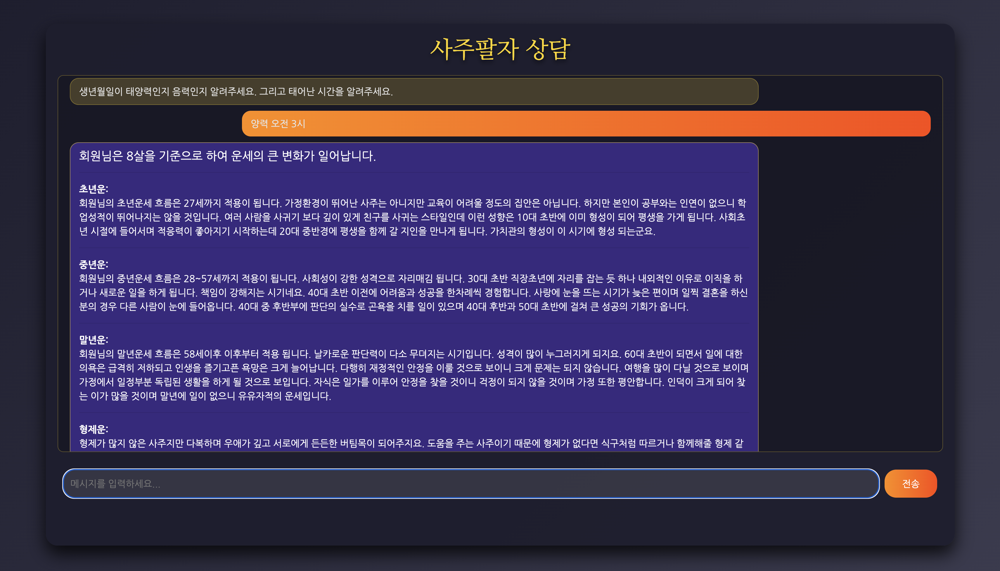

# 🌟 Deepdaiv Rag 사주 어플리케이션

## 소개
<table>
    <tr>
        <td></td>
        <td></td>
    </tr>
</table>

사주 어플리케이션은 사용자의 출생정보를 기반으로 개인의 사주를 분석하고, 운세, 성격, 직업 추천 등 심리 상담 서비스를 제공하는 웹 어플리케이션입니다. 이 어플리케이션은 전통적인 사주 이론을 현대적인 기술로 구현하여, 사용자에게 유용한 정보를 제공합니다.


## 기술 스택

- **프론트엔드**:    
- **백엔드**: 
- **데이터베이스**: 
- **배포**: 

## 설치 및 실행

### 사전 요구 사항

- python (v3.11)
- docker
- poetry

### 설치 방법

1. 이 저장소를 클론합니다:
   ```bash
   git clone https://github.com/deepdaiv-rag/24f-saju.git
   ```

2. 어플리케이션을 실행합니다:
   ```bash
   docker-compose build
   docker-compose up
   ```
